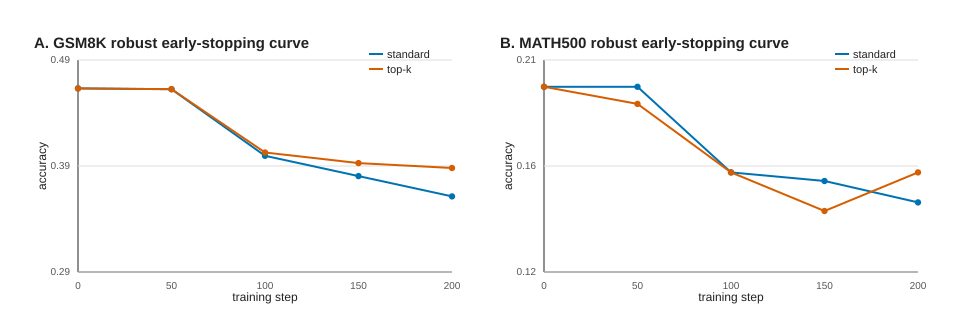
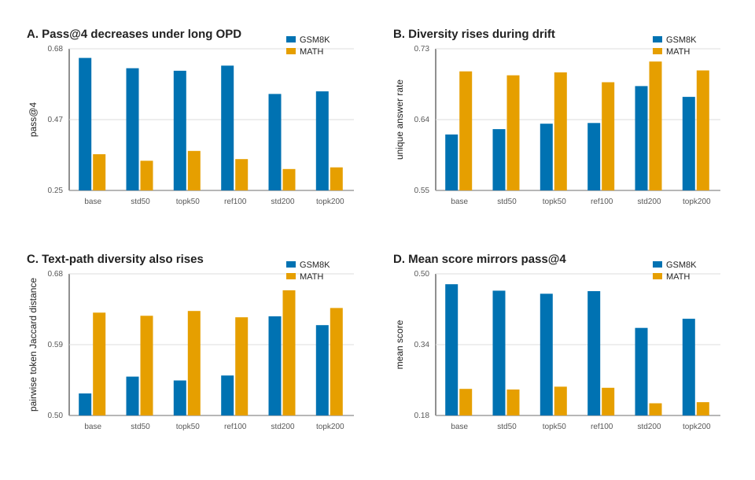
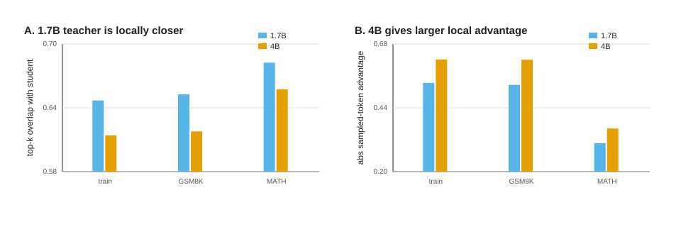

# Reliability-Conditioned On-Policy Distillation

## 摘要

On-Policy Distillation (OPD) 用学生自己的 rollout 作为训练分布，并在这些 student-visited prefixes 上向教师模型对齐。现有工作已经显示，OPD 的优势来自 on-policy dense supervision，但它也暴露出一个结构性矛盾：学生必须探索自己的前缀分布，教师却不一定能在这些前缀上提供可靠 token-level guidance。本文从这一矛盾出发，提出一个简单假设：OPD 不应在所有 token 上等强度执行，而应由教师在学生前缀上的局部可靠性控制 KL 强度和 reward extrapolation 强度。

我们提出 Reliability-Conditioned OPD (RC-OPD)：用 teacher-student top-k overlap、采样 token 是否落入教师 top-k、teacher margin 和 teacher entropy 构造局部可靠性门控。该门控有两种用法：一是对 reverse-KL/implicit-reward update 做软加权，二是只在可靠区域启用 ExOPD 式的 lambda > 1 外推。所有验证均在 clean-room 环境中进行，只使用官方公开模型 `Qwen/Qwen3-0.6B` 作为学生，`Qwen/Qwen3-4B` 和 `Qwen/Qwen3-1.7B` 作为教师候选，以及公开 GSM8K/MATH 数据。

初步结果显示，官方 Qwen3-0.6B/Qwen3-4B 配对在学生 rollout 上具有可观但非完美的局部兼容性，64 条诊断样本的 mean top-k overlap 为 0.619，router keep rate 为 0.963。在 10-step pilot 中，标准 OPD 从 base 的 GSM100 0.420 降到 0.360，而 top-k reliability routing 提升到 0.450，routed adaptive ExOPD 为 0.440。但 50-step pilot 给出了更谨慎的图景：在 GSM100 上，standard OPD 达到 0.460，top-k routing 为 0.440，full adaptive ExOPD 为 0.390，routed adaptive ExOPD 为 0.400；在 MATH100 上，standard 与 top-k routing 均为 0.250，routed adaptive ExOPD 为 0.260，full adaptive ExOPD 回到 base 的 0.220。进一步 ablation 显示，默认 top-k routing 存在 seed 不稳定，严格 gate 会过度过滤，较小的 `lambda=1.10` 比 `lambda=1.25` 安全但仍不能稳定胜过 standard OPD。full GSM8K/MATH500 batched evaluation 进一步收紧了结论：50-step standard OPD 在 GSM8K 上只从 41.70% 到 41.77%，在 MATH500 上从 16.0% 到 16.8%；top-k routing 在两项上分别为 41.70% 和 16.4%；routed `lambda=1.10` 在 GSM8K 上为 41.93%，但在 MATH500 上回到 16.0%。追加的 200-step experiment 是关键负结果：所有变体在 full GSM8K/MATH500 上都明显低于 base，说明当前 sampled-token OPD 会出现训练轨迹漂移；同一 200-step run 的 early-stopping curve 显示退化在 50 到 100 step 之间已经出现。离线 robust regrade 抬高了绝对分数，但保留了同一轨迹内的漂移趋势。后续独立 100-step runs 又显示 run-to-run variability：reference-anchored OPD 的 `anchored_topk_router` 降低梯度尖峰并在 GSM8K robust regrade 上达到 0.4193，但仍低于 base；新的 explicit reference-penalty run 中，普通 standard 在 GSM8K robust 上达到 0.4670，略高于 base 0.4625，但 MATH500 仍低于 base，而 reference-penalty 变体没有超过 standard。最后，官方 Qwen3-1.7B 中间教师给出一个 teacher-selection 反例：1.7B 在 student prefixes 上比 4B 更局部兼容，但 full robust regrade 下 1.7B-teacher OPD 在 GSM8K 上只有 0.440/0.449，低于 4B-teacher OPD 的 0.462/0.462 和 base 的 0.462；MATH500 上 1.7B top-k 为 0.204，略高于 base 0.202 和 4B top-k 0.194。换言之，局部可靠性 routing 与 reference anchoring 在小预算下能抑制负迁移并降低梯度尖峰，但它们不能保证最终 accuracy 优于标准 OPD；OPD 的问题更像训练轨迹选择、trust region 与 teacher capability gap 的耦合问题。

## 1. 动机

OPD 的理论基础通常写作 reverse KL:

```text
KL(pi_student || pi_teacher)
```

因为期望在学生分布上取值，OPD 能避免传统 off-policy SFT/KD 的 train-test prefix mismatch。但这并不意味着教师在所有 student prefixes 上都可靠。三条近期证据共同指向这一点：

1. `Rethinking OPD` 发现 OPD 成功依赖 thinking-pattern compatibility，并且梯度主要来自极少数共享高概率 token；长序列下教师的局部优势会退化。
2. `Revisiting OPD` 把 teacher guidance on student prefix unreliable 列为核心失败模式，并提出 local support matching。
3. `G-OPD/ExOPD` 说明 OPD 可视为固定 beta 的 dense KL-constrained RL，lambda > 1 的 reward extrapolation 能突破教师边界，但也会放大噪声。

因此，一个自然问题是：能否让 OPD 的强度依赖教师在当前 student prefix 上的局部可信度，而不是对所有 token 一视同仁？

## 2. 方法

给定学生生成的前缀 `x, y_<t`，我们计算教师与学生在当前位置的局部可靠性指标：

- `overlap`: 学生 top-k token 集与教师 top-k token 集的交集比例。
- `sampled_in_teacher_topk`: 学生实际采样 token 是否在教师 top-k 内。
- `teacher_margin`: 教师 top-1 与 top-2 logit/log-prob 的差距。
- `teacher_entropy`: 教师 top-k 归一化分布的熵。

由这些指标得到二值或软可靠性 `r_t`。本文 pilot 实现使用：

```text
weight_t = 0.10 + 0.90 * r_t
lambda_t = 1.00 + 0.25 * r_t
```

对应四个变体：

- `standard`: 标准 sampled-token OPD，`weight=1`, `lambda=1`。
- `topk_router`: 只做可靠性加权，`lambda=1`。
- `adaptive_exopd`: 全 token 使用 `lambda=1.25`。
- `routed_adaptive`: 可靠位置使用更强外推，不可靠位置退回接近标准 OPD。

后续 anchor 实验还加入两个 trust-region 风格变体：

- `anchored_standard`: 在 sampled-token advantage 中减去当前策略相对官方 student base/reference 的 gap。
- `anchored_topk_router`: 在 `anchored_standard` 上叠加 top-k reliability weight。
- `ref_penalty_standard`: 在标准 OPD loss 上加入 sampled-token `||log pi_current - log pi_reference||^2` penalty。
- `ref_penalty_topk_router`: 在 `ref_penalty_standard` 上叠加 top-k reliability weight。

## 3. 实验设置

### 3.1 Clean-Room 边界

本实验不使用任何用户自训 checkpoint、旧项目代码或旧项目结果；用户提醒的自训练 Qwen3-MoE checkpoint 被明确排除，不作为 student、teacher、reference、初始化或评测对象。官方模型 manifest 中只包含：

- Student: `Qwen/Qwen3-0.6B`, revision `c1899de289a04d12100db370d81485cdf75e47ca`
- Teacher: `Qwen/Qwen3-4B`, revision `1cfa9a7208912126459214e8b04321603b3df60c`
- Additional official teacher for teacher-selection diagnostics: `Qwen/Qwen3-1.7B`, revision `70d244cc86ccca08cf5af4e1e306ecf908b1ad5e`

训练数据使用公开 math prompts。评测先使用 GSM8K test 的前 100 条与 MATH-500 前 100 条作为快速 pilot，随后在完整 GSM8K test 和 MATH500 上做 batched sanity evaluation。简单 boxed/exact numeric grader 只作为早期筛选信号，不作为最终论文级评测。

### 3.2 Resume 与工程约束

每个训练 checkpoint 都保存模型、tokenizer、optimizer、global step、采样 offset、Python/Torch/CUDA RNG、训练参数与数据 manifest。真实 pilot 前先通过 save-resume gate：step1 保存，resume 后推进到 step2，并验证完整状态存在。

## 4. 初步结果

### 4.1 局部可靠性诊断

64 条学生 rollout 诊断结果：

| 指标 | 值 |
|---|---:|
| examples | 64 |
| scored tokens | 13,445 |
| mean top-k overlap | 0.619 |
| sampled token in teacher top-k | 0.998 |
| router keep rate | 0.963 |
| adaptive lambda mean | 1.241 |
| positive advantage rate | 0.791 |

解释：官方 Qwen3-0.6B/Qwen3-4B 不是“不可蒸馏”的跨家族配对；它们有足够 overlap 做 OPD。但 overlap 不是 1，说明对所有 token 等强度蒸馏仍有噪声风险。

### 4.2 10-Step Pilot

| 模型/变体 | GSM100 accuracy | avg generated tokens |
|---|---:|---:|
| Official Qwen3-0.6B base | 0.420 | 213.0 |
| standard OPD | 0.360 | 222.1 |
| topk_router | 0.450 | 218.3 |
| adaptive_exopd | 0.410 | 222.3 |
| routed_adaptive | 0.440 | 219.3 |

结论：在很小训练预算下，标准 OPD 发生负迁移；纯 `lambda=1.25` 外推没有解决问题；局部可靠性加权避免了负迁移，并给出小幅正增益。

### 4.3 50-Step Pilot

50-step 训练已完成，并通过所有 checkpoint 完整性验证。训练汇总：

| 变体 | avg grad norm | max grad norm | avg router keep | avg lambda | avg weight |
|---|---:|---:|---:|---:|---:|
| standard | 117.1 | 496.0 | 0.957 | 1.000 | 1.000 |
| topk_router | 98.2 | 238.0 | 0.957 | 1.000 | 0.961 |
| adaptive_exopd | 146.1 | 426.0 | 0.958 | 1.250 | 1.000 |
| routed_adaptive | 118.9 | 310.0 | 0.957 | 1.239 | 0.961 |

GSM100 final accuracy:

| 模型/变体 | GSM100 accuracy | avg generated tokens |
|---|---:|---:|
| Official Qwen3-0.6B base | 0.430 | 214.35 |
| standard OPD | 0.460 | 213.82 |
| topk_router | 0.440 | 215.34 |
| adaptive_exopd | 0.390 | 219.61 |
| routed_adaptive | 0.400 | 219.38 |

解释：50-step 结果没有复现 10-step 中 top-k routing 的 accuracy 优势。更稳妥的结论是，局部可靠性加权可以降低训练更新尖峰，但过强 filtering 可能削弱有效学习信号；而 `lambda>1` 的 reward extrapolation 在当前设置下风险更高。full `adaptive_exopd` 的 accuracy 最低、平均长度上升、平均梯度范数最高；`routed_adaptive` 降低了最大梯度但仍低于 base，说明当前 reliability gate 能缓和外推噪声，却不足以校正外推目标本身。

### 4.4 MATH100 Cross-Check

为避免只根据 GSM100 下结论，我们追加 MATH-500 前 100 条 pilot 评测：

| 模型/变体 | MATH100 accuracy | avg generated tokens |
|---|---:|---:|
| Official Qwen3-0.6B base | 0.220 | 236.84 |
| standard OPD | 0.250 | 237.28 |
| topk_router | 0.250 | 235.27 |
| adaptive_exopd | 0.220 | 235.67 |
| routed_adaptive | 0.260 | 235.28 |

解释：MATH100 与 GSM100 的排序不同。`routed_adaptive` 在 GSM100 上退化，但在 MATH100 上略高于 standard/topk；full `adaptive_exopd` 在两个集合上都没有超过 base。这说明当前最稳的结论不是“routing 提升准确率”，而是：

1. `lambda>1` 全局外推在本设置下不可取；
2. reliability gate 可以降低外推造成的训练尖峰，并在某些更难分布上保留或略增性能；
3. OPD/ExOPD 的最佳策略依赖任务分布，应把 local reliability 与 trajectory-level outcome/verifier 结合，而不是只看 token-local 指标。

### 4.5 Ablation: Seed, Gate Strictness, and Smaller Lambda

我们追加 4 个 50-step ablation：

| 变体 | 目的 | avg grad norm | max grad norm | avg keep | avg lambda | avg weight |
|---|---|---:|---:|---:|---:|---:|
| seed13_standard | standard seed stability | 106.1 | 282.0 | 0.958 | 1.000 | 1.000 |
| seed13_topk_default | topk seed stability | 97.8 | 300.0 | 0.955 | 1.000 | 0.959 |
| seed7_topk_strict | stricter gate | 72.1 | 292.0 | 0.610 | 1.000 | 0.688 |
| seed7_routed_lam110 | smaller ExOPD lambda | 112.7 | 284.0 | 0.956 | 1.096 | 0.960 |

GSM100:

| 变体 | GSM100 accuracy | avg generated tokens |
|---|---:|---:|
| seed13_standard | 0.430 | 220.29 |
| seed13_topk_default | 0.380 | 218.46 |
| seed7_topk_strict | 0.410 | 217.48 |
| seed7_routed_lam110 | 0.440 | 213.78 |

MATH100:

| 变体 | MATH100 accuracy | avg generated tokens |
|---|---:|---:|
| seed13_standard | 0.220 | 238.36 |
| seed13_topk_default | 0.270 | 237.23 |
| seed7_topk_strict | 0.200 | 238.44 |
| seed7_routed_lam110 | 0.250 | 236.11 |

解释：

1. 默认 top-k routing 不稳定：seed7 pilot 中 GSM100 为 0.440、MATH100 为 0.250；seed13 中 GSM100 降到 0.380，但 MATH100 升到 0.270。
2. 严格 gate 明显降低训练强度与梯度范数，但 accuracy 没有提升，MATH100 甚至降到 0.200。这支持“过度过滤会欠学习”。
3. `lambda=1.10` routed adaptive 比 `lambda=1.25` 安全：GSM100 从 0.400 提到 0.440，MATH100 从 0.260 降到 0.250 但仍高于 full `lambda=1.25` 的 0.220。较小 lambda 是可继续探索的区域，但仍不是稳定优于 standard 的结论。

### 4.6 Full-Split Batched Evaluation

我们对最关键的 4 个模型追加完整 GSM8K test 与 MATH500 batched evaluation。该评测仍使用同一个简单 numeric grader，并将 `max_new_tokens` 设为 256，因此结果应视为 sanity check，而不是最终 benchmark 数字。

GSM8K full test:

| 模型/变体 | examples | pass@1 | avg generated tokens |
|---|---:|---:|---:|
| Official Qwen3-0.6B base | 1,319 | 0.41698 | 255.81 |
| seed7 standard OPD | 1,319 | 0.41774 | 255.96 |
| seed7 topk_router | 1,319 | 0.41698 | 255.98 |
| seed7 routed_lam110 | 1,319 | 0.41926 | 255.94 |

MATH500 full:

| 模型/变体 | examples | pass@1 | avg generated tokens |
|---|---:|---:|---:|
| Official Qwen3-0.6B base | 500 | 0.160 | 256.00 |
| seed7 standard OPD | 500 | 0.168 | 256.00 |
| seed7 topk_router | 500 | 0.164 | 256.00 |
| seed7 routed_lam110 | 500 | 0.160 | 256.00 |

解释：full split 结果明显弱化了百题 pilot 的波动。GSM8K 上 `routed_lam110` 是最高，但只比 base 高 0.23 个百分点；MATH500 上 standard OPD 最高，比 base 高 0.8 个百分点，而 `routed_lam110` 没有收益。由于所有 full MATH500 输出都触及 256-token cap，长度指标主要反映评测上限而非真实推理长度。当前最稳妥的结论是：RC-OPD 的可靠性信号有助于解释和控制训练动态，但尚未证明为稳定 accuracy 改进；后续必须用多 seed、trajectory-level verifier 和更严格 grader 验证。

### 4.7 200-Step Outcome Reweighting: A Negative Result

为测试“轨迹级信号能否修复 token-local gate 的不足”，我们新增两个 outcome-conditioned 变体：

- `outcome_reweight`: 生成答案正确时将整条 trajectory KL 权重设为 0.5，错误时设为 1.5。
- `outcome_topk_router`: 在上述 trajectory 权重上再乘以 token-level top-k reliability weight。

训练仍使用官方 Qwen3-0.6B student 与官方 Qwen3-4B teacher，训练 200 step，保存 50/100/150/200 checkpoint，不删除任何 checkpoint。训练统计如下：

| 变体 | steps | avg grad norm | max grad norm | avg keep | avg weight | train rollout correct |
|---|---:|---:|---:|---:|---:|---:|
| standard | 200 | 72.49 | 266.0 | 0.955 | 1.000 | 0.315 |
| topk_router | 200 | 64.01 | 190.0 | 0.954 | 0.959 | 0.303 |
| outcome_reweight | 200 | 82.54 | 466.0 | 0.956 | 1.205 | 0.295 |
| outcome_topk_router | 200 | 74.18 | 346.0 | 0.955 | 1.143 | 0.305 |

Full GSM8K:

| 模型/变体 | examples | pass@1 | avg generated tokens |
|---|---:|---:|---:|
| seed7 standard OPD, 200 step | 1,319 | 0.32146 | 256.00 |
| seed7 topk_router, 200 step | 1,319 | 0.33889 | 256.00 |
| seed7 outcome_reweight, 200 step | 1,319 | 0.33359 | 256.00 |
| seed7 outcome_topk_router, 200 step | 1,319 | 0.33207 | 256.00 |

Full MATH500:

| 模型/变体 | examples | pass@1 | avg generated tokens |
|---|---:|---:|---:|
| seed7 standard OPD, 200 step | 500 | 0.118 | 256.00 |
| seed7 topk_router, 200 step | 500 | 0.132 | 256.00 |
| seed7 outcome_reweight, 200 step | 500 | 0.126 | 256.00 |
| seed7 outcome_topk_router, 200 step | 500 | 0.122 | 256.00 |

解释：这是一个强负结果。相比 base 的 GSM8K 0.41698 / MATH500 0.160，以及 50-step standard 的 GSM8K 0.41774 / MATH500 0.168，200-step 训练显著退化。`topk_router` 在两项上都是 200-step 组内最好，说明 token reliability 仍有减损作用；但它没有阻止长训漂移。简单 outcome reweighting 不但没有修复漂移，`outcome_reweight` 还产生最高 max grad norm 466.0。当前证据支持一个更窄的结论：trajectory signal 必须更精细地定位 first-divergence span 或结合 verifier correction，而不是把整条错误 trajectory 简单放大。

### 4.8 Early-Stopping Curve

为了定位退化从哪里开始，我们对同一组 200-step run 的 standard/topk checkpoints 追加 full GSM8K/MATH500 100-step 与 150-step 评测，并与已有 50-step、200-step full eval 合并：



**Figure 1.** 同一 200-step 训练轨迹上的 robust regrade 曲线显示，standard OPD 在 50 到 100 step 之间已经明显退化；top-k routing 不能阻止退化，但在后续 step 上相对减损。该图只支持“该训练轨迹存在早期漂移”，不支持固定步数必然退化的强结论。

GSM8K:

| step | standard | topk_router |
|---:|---:|---:|
| 0 / base | 0.41698 | 0.41698 |
| 50 | 0.41774 | 0.41698 |
| 100 | 0.35254 | 0.35254 |
| 150 | 0.33434 | 0.34875 |
| 200 | 0.32146 | 0.33889 |

MATH500:

| step | standard | topk_router |
|---:|---:|---:|
| 0 / base | 0.160 | 0.160 |
| 50 | 0.168 | 0.164 |
| 100 | 0.138 | 0.142 |
| 150 | 0.124 | 0.120 |
| 200 | 0.118 | 0.132 |

解释：退化不是 200-step 才突然发生，而是在 50 到 100 step 之间已经明显出现。GSM8K 上 standard 从 0.41774 跌到 0.35254，MATH500 从 0.168 跌到 0.138。topk_router 在 100 step 同样下跌，但在 150/200 step 的 GSM8K 上比 standard 高，说明它更像漂移减速器而非性能提升器。这支持把 reliability metrics 用作 early-stopping/trust-region trigger，而不是单纯作为 loss weight。

### 4.9 Offline Robust Regrade

为确认 early-stopping 结论不是简单 grader 的假象，我们对已保存 predictions 做离线 regrade。GSM8K 使用 boxed answer 或 final/last numeric answer 与 `####` gold number 的数值匹配；MATH500 保留 boxed/exact 与轻量 latex normalization，不引入强符号等价器，因此只作为 sanity regrade。

GSM8K robust primary score:

| step | standard | topk_router |
|---:|---:|---:|
| 0 / base | 0.46247 | 0.46247 |
| 50 | 0.46171 | 0.46171 |
| 100 | 0.39955 | 0.40258 |
| 150 | 0.38059 | 0.39272 |
| 200 | 0.36164 | 0.38817 |

MATH500 robust primary score:

| step | standard | topk_router |
|---:|---:|---:|
| 0 / base | 0.202 | 0.202 |
| 50 | 0.202 | 0.194 |
| 100 | 0.162 | 0.162 |
| 150 | 0.158 | 0.144 |
| 200 | 0.148 | 0.162 |

解释：robust regrade 改变了绝对分数，尤其 GSM8K 因为部分回答没有严格 boxed 但最后数字正确，base 从 0.41698 变为 0.46247；但 drift 结论不变。standard 在 GSM8K 上从 0.46171 at step50 跌到 0.39955 at step100，MATH500 从 0.202 跌到 0.162。topk_router 的 200-step GSM8K robust score 0.38817 高于 standard 0.36164，但仍明显低于 base/50-step。这进一步支持：reliability gate 的主要价值是 drift diagnosis / mitigation，而不是稳定提升。

### 4.10 Reference-Anchored OPD

early-stopping curve 说明退化在 50 到 100 step 之间出现，因此我们测试一个更直接的 trust-region 近似：用官方 Qwen3-0.6B base/reference 计算 sampled token 的 reference gap，并在 teacher advantage 中扣除策略相对 reference 的漂移项。该实验训练 100 step，比较 standard、top-k、anchored standard、anchored top-k。

训练统计：

| 变体 | steps | avg grad norm | max grad norm | avg keep | avg weight | avg reference gap | positive reference gap rate |
|---|---:|---:|---:|---:|---:|---:|---:|
| standard | 100 | 78.25 | 201.0 | 0.956 | 1.000 | - | - |
| topk_router | 100 | 70.99 | 224.0 | 0.956 | 0.960 | - | - |
| anchored_standard | 100 | 75.79 | 248.0 | 0.953 | 1.000 | 0.00055 | 0.397 |
| anchored_topk_router | 100 | 59.65 | 138.0 | 0.954 | 0.959 | 0.00114 | 0.457 |

Full GSM8K / MATH500 simple grader:

| 变体 | GSM8K | MATH500 |
|---|---:|---:|
| standard | 0.35481 | 0.134 |
| topk_router | 0.34572 | 0.140 |
| anchored_standard | 0.35406 | 0.124 |
| anchored_topk_router | 0.37149 | 0.134 |

Offline robust regrade:

| 变体 | GSM8K primary | MATH500 primary |
|---|---:|---:|
| standard | 0.40713 | 0.168 |
| topk_router | 0.39424 | 0.176 |
| anchored_standard | 0.40030 | 0.152 |
| anchored_topk_router | 0.41926 | 0.178 |

解释：anchored top-k 是该 100-step run 中最稳定的训练配置，max grad norm 降到 138，并在 GSM8K 上恢复到接近 50-step `routed_lam110` 的 robust score 0.41926。但它仍明显低于 base robust 0.46247，也没有修复 MATH500；MATH500 上 base robust 为 0.202，而 anchored top-k 只有 0.178。这个结果支持“reference anchoring 能部分抑制漂移”的弱结论，不支持“简单 reference-gap correction 足以解决 sampled-token OPD 长训退化”的强结论。下一步需要更明确的 KL trust region、adaptive stopping 或 per-trajectory verifier，而不是只在 sampled token 上扣一个 reference gap。

### 4.11 Explicit Reference-Penalty OPD

`anchored_*` 变体是在 implicit reward/advantage 中扣 reference gap，属于 sampled-token 层面的线性修正。为测试更直接的 trust-region 近似，我们加入 `ref_penalty_*` 变体：在原 OPD loss 上额外惩罚当前策略与官方 Qwen3-0.6B reference 在 sampled token 上的 log-prob gap。该实验训练 100 step，`reference_penalty_beta=0.05`，比较 standard、top-k、ref-penalty standard、ref-penalty top-k。

训练统计：

| 变体 | steps | avg grad norm | max grad norm | avg keep | avg weight | avg ref penalty | avg abs current-ref gap |
|---|---:|---:|---:|---:|---:|---:|---:|
| standard | 100 | 113.37 | 231.0 | 0.955 | 1.000 | - | - |
| topk_router | 100 | 95.61 | 370.0 | 0.956 | 0.960 | - | - |
| ref_penalty_standard | 100 | 124.96 | 1144.0 | 0.958 | 1.000 | 0.000743 | 0.00968 |
| ref_penalty_topk_router | 100 | 92.78 | 382.0 | 0.956 | 0.961 | 0.000539 | 0.00950 |

Full GSM8K / MATH500 simple grader:

| 变体 | GSM8K | MATH500 |
|---|---:|---:|
| standard | 0.42381 | 0.156 |
| topk_router | 0.39651 | 0.164 |
| ref_penalty_standard | 0.40182 | 0.152 |
| ref_penalty_topk_router | 0.41395 | 0.164 |

Offline robust regrade:

| 变体 | GSM8K primary | MATH500 primary |
|---|---:|---:|
| standard | 0.46702 | 0.196 |
| topk_router | 0.44428 | 0.198 |
| ref_penalty_standard | 0.45337 | 0.188 |
| ref_penalty_topk_router | 0.45792 | 0.194 |

解释：这个实验给出两个修正。第一，100-step 退化不是每条训练轨迹都必然复现：本 run 中 standard 在 GSM8K robust primary 上略高于 base 0.46247，但 MATH500 仍低于 base 0.202。这说明“50 到 100 step 之间退化”应表述为特定 trajectory 上观察到的早期漂移，而不是固定步数规律。第二，explicit reference penalty 在 `beta=0.05` 下没有解决问题：ref-penalty standard 低于 standard，ref-penalty top-k 只相对 top-k 改善 GSM8K，但仍低于 standard；同时 ref-penalty standard 出现 max grad norm 1144 的尖峰。由于平均 sampled-token current-reference gap 只有约 0.01，该 penalty 可能太弱；但简单提高 beta 也可能放大梯度冲突。因此下一步不应只调大 sampled-token penalty，而应估计 batch/sequence-level KL 或用 held-out validation/reliability 指标自适应调 KL coefficient。

### 4.12 Pass@4 and Diversity: Drift Is Not Simple Mode Collapse

前面的 full split 评测主要看 pass@1。为检查 OPD 退化是否来自 reverse-KL mode collapse 或输出多样性收缩，我们追加 pass@4/diversity 评测：GSM8K 前 256 题、MATH500 前 200 题，每题采样 4 次，`max_new_tokens=256`，seed 17。对每个模型计算 robust mean score、robust pass@4、唯一最终答案比例、pairwise token Jaccard distance 和长度上限命中率。



**Figure 2.** 长训后的 standard200 在 pass@4 和 mean score 上明显下降，但 unique answer rate 与 token-path Jaccard distance 上升。这说明本设置里的漂移不是简单的输出多样性收缩，而更像更多低质量推理路径的扩散。topk200 相比 standard200 略提高 pass@4，同时降低多样性，符合“把分布拉回教师局部支持区域”的解释。

GSM8K-256 pass@4/diversity:

| 模型 | robust mean | pass@4 | unique answer rate | pairwise Jaccard distance | hit max token |
|---|---:|---:|---:|---:|---:|
| base | 0.4766 | 0.6523 | 0.6211 | 0.5280 | 1.0000 |
| standard50 | 0.4619 | 0.6211 | 0.6279 | 0.5494 | 1.0000 |
| topk50 | 0.4551 | 0.6133 | 0.6348 | 0.5445 | 1.0000 |
| refpen_topk100 | 0.4609 | 0.6289 | 0.6357 | 0.5508 | 0.9922 |
| standard200 | 0.3779 | 0.5430 | 0.6826 | 0.6260 | 1.0000 |
| topk200 | 0.3984 | 0.5508 | 0.6689 | 0.6148 | 1.0000 |

MATH200 pass@4/diversity:

| 模型 | robust mean | pass@4 | unique answer rate | pairwise Jaccard distance | hit max token |
|---|---:|---:|---:|---:|---:|
| base | 0.2400 | 0.3600 | 0.7013 | 0.6307 | 1.0000 |
| standard50 | 0.2387 | 0.3400 | 0.6963 | 0.6267 | 1.0000 |
| topk50 | 0.2450 | 0.3700 | 0.7000 | 0.6328 | 1.0000 |
| refpen_topk100 | 0.2425 | 0.3450 | 0.6875 | 0.6248 | 1.0000 |
| standard200 | 0.2075 | 0.3150 | 0.7137 | 0.6591 | 1.0000 |
| topk200 | 0.2100 | 0.3200 | 0.7025 | 0.6366 | 1.0000 |

解释：OPD 长训退化不是简单的多样性塌缩。相反，standard200 在 GSM8K/MATH 上的 unique answer rate 和 pairwise Jaccard distance 都高于 base，但 robust mean/pass@4 明显降低。这更像错误推理路径扩散或策略漂移：模型探索了更多不同答案和文本路径，但这些路径质量更低。topk200 相比 standard200 略提高 GSM8K/MATH pass@4，同时降低 unique answer rate 与 Jaccard distance，说明 top-k reliability routing 的减损作用可能来自把采样分布收回教师局部支持区域，而不是增加探索。MATH200 上 topk50 是唯一超过 base pass@4 的 50-step 变体，但 GSM8K 上所有 50-step OPD 都低于 base；这再次说明 RC/OPD 的收益强烈依赖任务分布和训练轨迹。

该结果也修正了对 reverse-KL mode collapse 的直觉：至少在本设置中，主要风险不是“输出变得过于单一”，而是 sampled-token OPD 在长训中把概率质量推向更多但更差的局部路径。下一步应同时监控 diversity 和 quality：仅保多样性不足以防止 OPD 退化，可靠性/teacher support/verifier 信号需要判别“有用多样性”和“错误扩散”。

### 4.13 Teacher Local Distinguishability

为测试“更大 teacher 是否真的在 student prefixes 上提供更有用的局部目标”，我们下载官方 `Qwen/Qwen3-1.7B`，固定 revision `70d244cc86ccca08cf5af4e1e306ecf908b1ad5e`。在同一批 Qwen3-0.6B student rollouts 上比较 0.6B reference、1.7B teacher 和 4B teacher。每个分布取 96 examples，`max_new_tokens=128`。



**Figure 3.** 1.7B teacher 在 student-visited prefixes 上与 student 的 top-k overlap 更高，因此局部更兼容；但 4B teacher 的 sampled-token advantage 幅度更大，说明它提供更多可迁移差异。后续 OPD 结果显示，compatibility 高并不充分，teacher selection 至少需要 compatibility 和 capability/task gap 双轴。

| dataset | tokens | 1.7B overlap with student | 4B overlap with student | 1.7B abs advantage | 4B abs advantage | 1.7B-4B top-k overlap | 1.7B-4B sign disagreement |
|---|---:|---:|---:|---:|---:|---:|---:|
| train prompts | 12,152 | 0.647 | 0.614 | 0.534 | 0.622 | 0.701 | 0.129 |
| GSM8K eval | 12,161 | 0.653 | 0.618 | 0.527 | 0.620 | 0.701 | 0.143 |
| MATH500 eval | 12,249 | 0.682 | 0.657 | 0.307 | 0.362 | 0.718 | 0.117 |

解释：1.7B teacher 在三个分布上都比 4B teacher 更贴近 0.6B student：top-k overlap 更高，sampled-token advantage 幅度更小。1.7B 和 4B 之间的 top-k overlap 约 0.70，advantage sign disagreement 约 0.12-0.14，说明二者大部分 token-level direction 一致，但仍有非平凡局部差异。MATH500 上两者更接近，log-prob abs diff 更低，这可能解释 teacher choice 在 MATH100 上差异较小。

### 4.14 1.7B Teacher OPD: Compatibility Is Not Sufficient

如果 local compatibility 是充分条件，那么 1.7B teacher 应该比 4B teacher 更稳定或更强。我们用同样训练设置补充 1.7B-teacher 50-step OPD，对照 `standard` 和 `topk_router`。训练前通过 1-step save / resume-to-2 gate，step50 checkpoint 完整性检查通过。随后对 1.7B/4B teacher 自身做 full GSM8K/MATH500 generation eval，并对 1.7B-teacher OPD 做 full GSM8K/MATH500 eval 与 offline robust regrade。

训练统计：

| teacher | variant | avg grad norm | max grad norm | avg overlap | avg router keep | avg teacher entropy |
|---|---|---:|---:|---:|---:|---:|
| Qwen3-1.7B | standard | 98.49 | 242.0 | 0.661 | 0.960 | 0.173 |
| Qwen3-1.7B | topk_router | 95.73 | 388.0 | 0.660 | 0.959 | 0.174 |

Pilot accuracy on 100-example slices:

| teacher | variant | GSM100 | MATH100 |
|---|---|---:|---:|
| Qwen3-0.6B base | - | 0.430 | 0.220 |
| Qwen3-4B | standard | 0.460 | 0.250 |
| Qwen3-4B | topk_router | 0.440 | 0.250 |
| Qwen3-1.7B | standard | 0.410 | 0.240 |
| Qwen3-1.7B | topk_router | 0.390 | 0.260 |

Teacher direct generation, full robust regrade:

| model | GSM8K primary | MATH500 primary |
|---|---:|---:|
| Qwen3-0.6B base | 0.462 | 0.202 |
| Qwen3-1.7B teacher | 0.440 | 0.168 |
| Qwen3-4B teacher | 0.458 | 0.154 |

1.7B-teacher OPD, full robust regrade:

| model | GSM8K primary | MATH500 primary |
|---|---:|---:|
| Qwen3-0.6B base | 0.462 | 0.202 |
| 4B-teacher standard OPD, 50 step | 0.462 | 0.202 |
| 4B-teacher topk OPD, 50 step | 0.462 | 0.194 |
| 1.7B-teacher standard OPD, 50 step | 0.440 | 0.194 |
| 1.7B-teacher topk OPD, 50 step | 0.449 | 0.204 |

解释：这是对 teacher-selection idea 的关键反例，也是一个边界条件。1.7B teacher 更局部兼容，但 GSM8K direct generation 和 1.7B-teacher OPD 都低于 4B-teacher OPD/base；MATH500 上 1.7B direct generation 高于 4B，1.7B top-k OPD 也略高于 base/4B top-k。结论不是“选 overlap 最高的 teacher”，也不是“选 direct-generation 分数最高的 teacher”，而是 teacher 选择至少需要两个轴：local compatibility 决定信号是否可学，capability gap 或任务相关增量决定信号是否值得学。只靠 top-k overlap 会偏向“更像学生”的 teacher，可能降低可迁移能力；只靠 teacher 自身 pass@1 也会遗漏 teacher-on-student-prefix 的局部可用性。

## 5. 讨论

RC-OPD 的核心不是重新设计一个复杂的蒸馏目标，而是把 OPD 失败机制中已经被反复观察到的“教师局部不可靠”显式变成训练控制变量。当前结果支持较弱但有价值的版本：reliability signal 更像一个稳定性诊断和学习率/权重调节器，而不是一个单独足以提升 accuracy 的 magic gate。200-step negative result 和同轨迹 early-stopping curve 表明，sampled-token OPD 的长训漂移是真问题；独立 100-step runs 又显示漂移强度有明显 run-to-run variability。因此问题不只是“跑到某一步就退化”，而是当前 objective 缺少能稳定选择好训练轨迹的 trust-region/validation 控制。简单 token gate、整轨迹 outcome scaling 和 sampled-token reference penalty 都不足以单独解决该问题。它兼容三条已有路线：

- 与 local support matching 兼容：教师 top-k 支持集不仅可用于截断 KL，也可用于控制 update strength。
- 与 ExOPD 兼容：lambda > 1 不应全局启用，而应只在教师局部优势清晰时启用。
- 与 trajectory/token reweighting 兼容：trajectory 级过滤决定哪条 rollout 值得学，RC-OPD 决定 rollout 内哪些 token 值得强学。
- 与 early stopping / trust-region control 兼容：一条 200-step 训练轨迹在 50 到 100 step 之间明显退化，另一条 100-step standard run 在 GSM8K 上没有退化但 MATH500 仍弱于 base；简单 reference anchoring 能降低梯度尖峰并在 GSM8K 上减轻部分退化，explicit sampled-token reference penalty 在 `beta=0.05` 下没有优于 standard。
- 与 teacher selection 兼容：local compatibility 可作为 teacher scoring 的一个轴，但 1.7B-teacher 反例说明它不能替代能力差距；更像学生的 teacher 不一定更有用。
- 与 diversity monitoring 兼容：pass@4 结果显示长训退化伴随多样性上升而非收缩，因此只监控 entropy/diversity 不足以发现质量漂移；需要把 diversity 与 verifier/reliability 联合解释。

## 6. 局限

当前结果仍是机制级实验，还不是完整 benchmark 论文：

- 训练步数覆盖 10/50/200 step，但只在一个 student-teacher pair 上验证。
- 200-step 结果显示一条训练轨迹会明显退化，但新的 100-step run 显示退化存在 run-to-run variability；尚未定位差异来自采样轨迹、数据顺序、学习率、长度上限、answer grader 噪声还是 sampled-token objective 本身。
- 100-step reference anchoring 与 explicit reference penalty 都是 sampled-token 层面的近似 correction，尚未实现显式 sequence-level KL trust region。
- GSM100/MATH100 与 full GSM8K/MATH500 batched evaluation 都使用轻量 grader；offline robust regrade 支持主要趋势，但仍不能替代严格 GSM8K/MATH500/AIME 评测或人工审计。
- pass@4/diversity 只在 GSM8K-256 和 MATH200 子集上运行，且所有模型几乎都触及 256-token 上限；该实验能比较相对差异，但不能作为最终 pass@k benchmark。
- 只有一个主要 student-teacher pair，尚未验证跨模型家族、base/instruct 差异、多教师场景。
- 1.7B teacher 已做 50-step pilot 与 full GSM8K/MATH500 robust regrade，但还缺少多 seed 与更长训练曲线。
- sampled-token OPD 实现是近似目标，尚未覆盖完整 sequence-level reverse KL 或 stop-gradient top-k KL。

## 7. 下一步实验

1. 在 full GSM8K/MATH500 上做多 seed、early stopping sweep 和严格 grader 评测。
2. 加入 reliability threshold ablation：overlap-only、margin-only、entropy-only、combined。
3. 扩展 teacher-selection sweep：官方 1.7B/4B/其他同家族模型，比较 local compatibility、capability gap 与 OPD gain 的相关性。
4. 将 RC-OPD 接到 trajectory filter：低 teacher log-prob trajectory hard filter，高可靠 token soft weight。
5. 将 reference anchoring 从 sampled-token gap 扩展为显式 KL trust region，并用 reliability/entropy/outcome 指标触发 adaptive stopping。
6. 将 pass@k/diversity 扩展到更大子集和更长 token budget，区分有用多样性与错误扩散。
7. 在 OPSD 场景中测试 evidence mask + reliability gate，验证是否能减少 privileged style drift。

## 参考文献

- Agarwal et al., On-Policy Distillation of Language Models: Learning from Self-Generated Mistakes, https://arxiv.org/abs/2306.13649
- Gu et al., MiniLLM: Knowledge Distillation of Large Language Models, https://arxiv.org/abs/2306.08543
- Li et al., Rethinking On-Policy Distillation of Large Language Models: Phenomenology, Mechanism, and Recipe, https://arxiv.org/abs/2604.13016
- Fu et al., Revisiting On-Policy Distillation: Empirical Failure Modes and Simple Fixes, https://arxiv.org/abs/2603.25562
- Yang et al., Learning beyond Teacher: Generalized On-Policy Distillation with Reward Extrapolation, https://arxiv.org/abs/2602.12125
- Zhu et al., The Many Faces of On-Policy Distillation, https://arxiv.org/abs/2605.11182
- Li et al., FiRe-OPD: Filter, Then Reweight, https://arxiv.org/abs/2606.02684
- Lazaridis et al., EDGE-OPD, https://arxiv.org/abs/2605.23493
- Nicolicioiu et al., On-Policy Self-Distillation with Sampled Demonstrations Reduces Output Diversity, https://arxiv.org/abs/2606.26091
- Qwen Team, Qwen3 Technical Report, https://arxiv.org/abs/2505.09388
